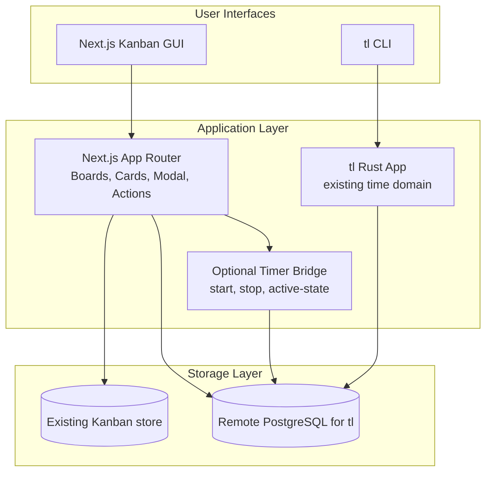

# Unified Product Architecture Specification

## Kanban + Time Logger Integration

### v1 Scope

- single-user only
- Next.js Kanban app remains the primary board UI
- `tl` remains mostly unchanged as the time-tracking system
- `tl` switches from local SQLite to remote PostgreSQL
- exactly one active timer globally
- auto-stop only when the active timer belongs to the completed card
- each Kanban card exposes a `Start Timer` action
- stopping a timer or marking a card done logs the session into the `tl` database
- the Trello card title is used as the logged session description
- an optional small VPS-side listener/service may be added if it improves timer reliability

---

## 1. Executive Summary

The product keeps the existing Next.js Kanban application as the primary user experience and keeps the existing Rust `tl` application mostly intact. The main required infrastructure change is moving `tl` from local SQLite to a remote PostgreSQL database on the VPS. The Kanban app then integrates with `tl` by starting and stopping timer sessions that are stored in that PostgreSQL database, using the card title as the logged session description.

- One shared time-tracking dataset for CLI and Kanban actions
- Minimal change to the proven `tl` workflow and codebase
- Optional room for a small server-side bridge without requiring a full platform rewrite

---

## 2. Goals and Constraints

### Goals

1. Preserve all current Kanban features.
2. Preserve current `tl` behavior as much as possible.
3. Switch `tl` storage from local SQLite to remote PostgreSQL.
4. Enable timing directly from Kanban cards.
5. Stop timers automatically when the matching card is completed.
6. Use the Trello card title as the logged session description.
7. Keep room for an optional VPS-side timer bridge if direct integration proves brittle.

### Confirmed Constraints

| Area | Decision |
|---|---|
| User scope | Single-user only in v1 |
| GUI | Existing Next.js Kanban app |
| `tl` change scope | Minimal; switch persistence to remote PostgreSQL |
| Time integration path | Direct PostgreSQL writes first, optional thin bridge second |
| Active timer policy | Exactly one active timer globally |
| Auto-stop behavior | Only for timers linked to the completed card |
| Session description | Use the Trello card title |
| Database | Remote PostgreSQL on VPS |

---

## 3. Current Systems Summary

### Kanban application

The current web application is a solid single-user Kanban experience with workspaces, boards, lists, tasks, drag-and-drop, optimistic updates, and a detailed task modal. It is built on Next.js App Router and already has the right user-facing surface for timer buttons and completion hooks.

**Strengths**
- polished interaction model
- established board/list/card structure
- responsive UI with optimistic updates

**Weaknesses**
- time tracking does not exist as a native domain
- current auth model is minimal

### `tl` CLI

The Rust CLI provides the existing time-tracking domain: real-time timing, manual logging, overlap validation, reporting, goals, streaks, reviews, exports, and backup-oriented behavior.

**Strengths**
- strong domain logic
- efficient CLI UX
- robust validation principles

**Weaknesses**
- local SQLite storage assumption
- no GUI integration
- no shared remote datastore yet

---

## 4. Target Architecture

### Ownership model

| Responsibility | Next.js | `tl` / optional bridge |
|---|---|---|
| Browser auth UX | Yes | No |
| Boards/lists/cards CRUD | Yes | No |
| Start/stop timer from card UI | Yes | Yes |
| Canonical timer/session semantics | No | Yes |
| Manual/batch logging | No | Yes |
| Reports/review/exports | No | Yes |
| Enforce one active timer | No | Yes |

---

## 5. Functional Specification

## 5.1 Card Timing

### Start timer from a card

Each Kanban card should expose a `Start Timer` button both on the card surface and inside the task detail modal.

**Flow**
1. User opens a card or sees it on the board.
2. User clicks `Start Timer`.
3. The Kanban app starts a new active session in the `tl` PostgreSQL database, either directly or through the optional bridge.
4. The session description is set to the card title.
5. The card and modal show that the timer is running.

### Single global active timer

Only one timer may be active at a time across the whole system so Kanban and `tl` stay consistent.

**Behavior when another timer exists**
- UI must clearly show the existing active timer.
- Starting another timer should trigger an explicit replace flow.
- The system must never silently move timer ownership.

### Stop timer from card modal

The card detail modal must expose `Stop Timer` as the main timer control when that card owns the active session.

### Auto-stop on completion

When a card is moved to a terminal list or explicitly marked completed:

- if the active timer is linked to that card, stop and log it automatically
- if the active timer is unrelated, do not stop it
- the resulting logged session keeps the card title as its description

### Session mapping rules

- `description` maps to the Trello card title
- if `tl` continues to use `notes`, the card title should be stored there until a dedicated description field exists
- category mapping may start with a simple default such as `kanban` and evolve later through label/category rules

---

## 5.2 Time Management / Progress & Feedback

The richer `tl` reporting surface remains valuable, but it is not required to block the initial Kanban timer integration. Read-only views or deeper GUI reporting can follow once start/stop logging is stable.

### Dashboard sections

1. **Today**
   - active timer
   - today total
   - top categories
   - top cards
2. **Progress**
   - goals
   - daily progress bars
   - time by category
3. **Feedback**
   - streaks
   - compare this week vs last week
   - review prompts
4. **History**
   - sessions table
   - filters by date, category, card
5. **Exports**
   - CSV
   - JSON
   - Obsidian
6. **Batch Log**
   - GUI equivalent of `tl log`

---

## 5.3 Category and Label Model

### Hybrid mapping

Kanban color labels may later suggest `tl` categories, but this is a follow-up concern rather than a blocker for starting and stopping timers from cards.

### Rules

1. Cards may have visual labels.
2. Cards may also have a dedicated time category.
3. Label-to-category mapping is configurable in settings.
4. The user may override any suggested category.
5. Sessions store a category snapshot for historical consistency.

---

## 5.4 CLI Behavior

### Remote database mode

`tl` should talk to remote PostgreSQL instead of local SQLite.

### Compatibility goal

The CLI should preserve its current UX and behavior as much as possible while only changing the storage backend.

---

## 5.5 Real-Time and UI Responsiveness

### Web UI

- board and card interactions remain optimistic
- timer commands show immediate UI feedback
- active timer state may be refreshed by polling, direct reads, or a small listener if added

### CLI

- CLI behavior remains close to current `tl`
- no new sync UX is required in this phase

---

## 6. Non-Functional Requirements

| Category | Requirement |
|---|---|
| Integrity | one active timer globally |
| Integrity | no overlapping sessions |
| UX | timer state always visible when active |
| Reliability | CLI cache survives restarts |
| Security | PATs hashed at rest |
| Observability | all time mutations audited |
| Performance | start/stop timer should feel instant to the user |
| Operability | health checks and structured logs for Next.js and Rust API |

---

## 7. Open Questions

1. Should starting a new timer automatically offer `Stop current and start this one` as a combined action?
2. Should free-form sessions with no linked card be fully supported in the GUI in v1 or primarily remain a CLI power-user path?
3. Should label-to-category suggestions also consider board/list context in v1?

---

## 8. Delivery Recommendation

Implement in three broad stages:

1. foundation and service boundaries
2. card-level timing integration
3. insights, exports, and CLI sync hardening
