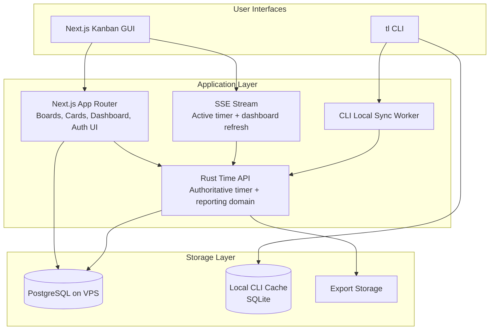

# Unified Product Architecture Specification

## Kanban + Time Intelligence Platform

### v1 Scope

- single-user only
- cloud-first Next.js GUI
- Rust HTTP API with PAT authentication for CLI
- exactly one active timer globally
- auto-stop only when the active timer belongs to the completed card
- color labels may suggest categories, but hierarchical categories remain independently assignable
- `tl` CLI supports local cache with background sync

---

## 1. Executive Summary

The merged product will keep the existing Next.js Kanban application as the primary user experience and integrate the `tl` time-logging domain through a thin Rust HTTP API running on the VPS. PostgreSQL becomes the canonical datastore for boards, cards, sessions, categories, goals, and exports. The web application stays cloud-first, while the CLI remains first-class by using PAT-authenticated API access plus a local cache and background sync model for offline operation.

- One coherent product for planning, execution, and reflection
- One authoritative timer/reporting engine shared by GUI and CLI
- A simpler v1 delivery path through single-user scope and explicit domain ownership

---

## 2. Goals and Constraints

### Goals

1. Preserve all current Kanban features.
2. Preserve all current `tl` analytical capabilities or provide equivalent GUI workflows.
3. Enable timing directly from cards.
4. Support immediate timer start during card creation.
5. Stop timers automatically when the matching card is completed.
6. Keep `tl` usable for power users.
7. Use one central database on the VPS.

### Confirmed Constraints

| Area | Decision |
|---|---|
| User scope | Single-user only in v1 |
| GUI | Cloud-first |
| CLI backend | Rust HTTP API with PAT auth |
| Active timer policy | Exactly one active timer globally |
| Auto-stop behavior | Only for timers linked to the completed card |
| Labels vs categories | Hybrid model with suggestion + override |
| CLI offline mode | Supported via local cache + background sync |

---

## 3. Current Systems Summary

### Kanban application

The current web application is a solid single-user Kanban experience with workspaces, boards, lists, tasks, drag-and-drop, optimistic updates, and a detailed task modal. It is built on Next.js App Router with Drizzle and local SQLite.

**Strengths**
- polished interaction model
- established board/list/card structure
- responsive UI with optimistic updates

**Weaknesses**
- local SQLite is not suitable as shared product storage
- time tracking does not exist as a native domain
- current auth model is minimal

### `tl` CLI

The Rust CLI provides the strongest business logic in the combined system: real-time timing, manual logging, overlap validation, reporting, goals, streaks, reviews, exports, and backup-oriented behavior.

**Strengths**
- strong domain logic
- efficient CLI UX
- robust validation principles

**Weaknesses**
- local-only assumptions
- no GUI integration
- no central identity or cloud source of truth

---

## 4. Target Architecture

### Ownership model

| Responsibility | Next.js | Rust Time API |
|---|---|---|
| Browser auth UX | Yes | No |
| Boards/lists/cards CRUD | Yes | No |
| Timer semantics | No | Yes |
| Manual/batch logging | No | Yes |
| Reports/compare/review | No | Yes |
| Goals/streaks | No | Yes |
| Export generation | No | Yes |
| Dashboard rendering | Yes | No |
| CLI sync reconciliation | No | Yes |

---

## 5. Functional Specification

## 5.1 Card Timing

### Create task and optionally start timer

When creating a card, the user may choose `Create` or `Create & Start Timer`.

**Flow**
1. User submits the card form.
2. Next.js creates the card.
3. If immediate timing is selected, Next.js sends a start command to the Rust API.
4. The active timer bar appears.
5. The card displays an active timer pill.

### Single global active timer

Only one timer may be active at a time across the whole system.

**Behavior when another timer exists**
- UI must clearly show the existing active timer.
- Starting another timer should trigger an explicit replace flow.
- The system must never silently move timer ownership.

### Stop timer from card modal

The card detail modal must expose `Stop Timer` as the main timer control when that card owns the active session.

### Auto-stop on completion

When a card is moved to a terminal list or explicitly marked completed:

- if the active timer is linked to that card, stop and log it automatically
- if the active timer is unrelated, do not stop it

---

## 5.2 Time Management / Progress & Feedback

The Kanban UI must include a dedicated section for time intelligence.

### Dashboard sections

1. **Today**
   - active timer
   - today total
   - top categories
   - top cards
2. **Progress**
   - goals
   - daily progress bars
   - time by category
3. **Feedback**
   - streaks
   - compare this week vs last week
   - review prompts
4. **History**
   - sessions table
   - filters by date, category, card
5. **Exports**
   - CSV
   - JSON
   - Obsidian
6. **Batch Log**
   - GUI equivalent of `tl log`

---

## 5.3 Category and Label Model

### Hybrid mapping

Kanban color labels stay lightweight and visual. They may suggest a time category, but they do not replace explicit hierarchical categories.

### Rules

1. Cards may have visual labels.
2. Cards may also have a dedicated time category.
3. Label-to-category mapping is configurable in settings.
4. The user may override any suggested category.
5. Sessions store a category snapshot for historical consistency.

---

## 5.4 CLI Behavior

### Online mode

In online mode, CLI commands talk to the Rust API using a PAT.

### Offline mode

In offline mode, the CLI writes to a local cache and operation queue, then syncs later.

### Sync expectations

- queued operations are replayed in order
- every replayed mutation uses an idempotency key
- conflicts are visible to the user
- no silent destructive conflict resolution

### Status states

- synced
- pending sync
- conflict

---

## 5.5 Real-Time and UI Responsiveness

### Web UI

- board and card interactions remain optimistic
- timer commands show immediate UI feedback
- SSE updates reconcile active timer and dashboard refreshes

### CLI

- local state is explicit when not yet synced
- offline and conflict states are surfaced in terminal output

---

## 6. Non-Functional Requirements

| Category | Requirement |
|---|---|
| Integrity | one active timer globally |
| Integrity | no overlapping sessions |
| UX | timer state always visible when active |
| Reliability | CLI cache survives restarts |
| Security | PATs hashed at rest |
| Observability | all time mutations audited |
| Performance | start/stop timer should feel instant to the user |
| Operability | health checks and structured logs for Next.js and Rust API |

---

## 7. Open Questions

1. Should starting a new timer automatically offer `Stop current and start this one` as a combined action?
2. Should free-form sessions with no linked card be fully supported in the GUI in v1 or primarily remain a CLI power-user path?
3. Should label-to-category suggestions also consider board/list context in v1?

---

## 8. Delivery Recommendation

Implement in three broad stages:

1. foundation and service boundaries
2. card-level timing integration
3. insights, exports, and CLI sync hardening
